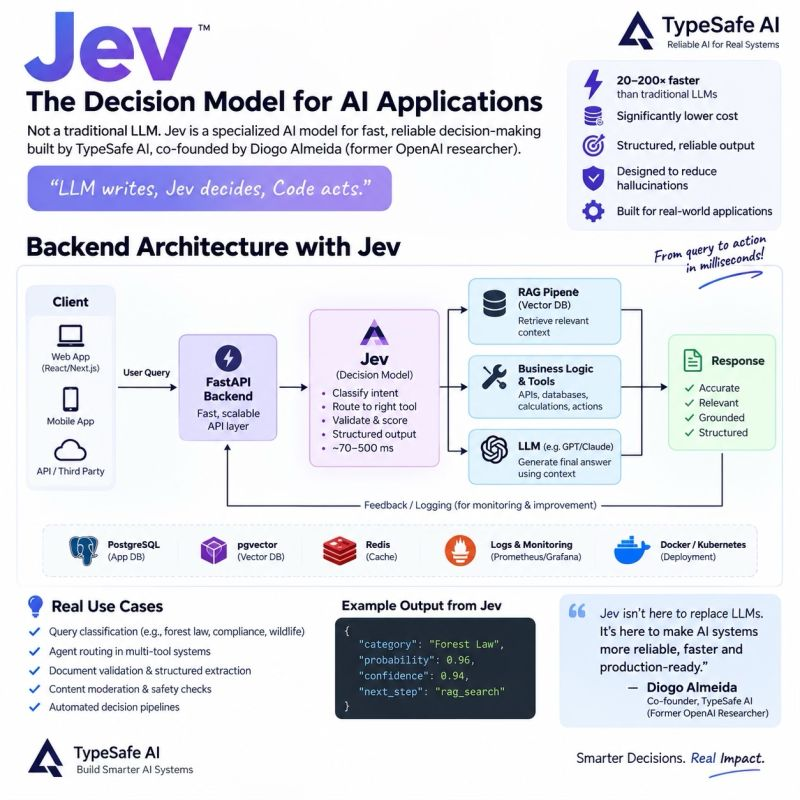

Jev: A New Approach

Most AI applications don’t need an LLM to make every decision.

That’s where Jev, a decision model from TypeSafe AI, becomes interesting.

The idea is simple:

LLM writes. Jev decides. Code acts.

Instead of asking an LLM to handle every routing, classification, validation, or tool-selection decision, Jev can act as a dedicated decision layer between your application and AI systems.

🔹 A practical backend architecture

User → FastAPI → Jev → RAG / Tools / LLM → Response

Jev can help with tasks such as:

• Query classification
• Agent & tool routing
• Structured decision-making
• Validation & scoring
• Document classification
• Automated decision pipelines

This architecture can be particularly interesting for RAG and agentic AI systems, where deterministic routing and structured outputs are important.

For example:

User Query
    ↓
FastAPI
    ↓
Jev — Decision Layer
    ↓
 ┌──────────┬──────────┬──────────┐
 │   RAG    │  Tools   │   LLM    │
 └──────────┴──────────┴──────────┘
    ↓
Structured Response

The bigger idea isn’t necessarily replacing LLMs.

It’s about using the right model for the right job:

LLM → Generate & Reason
Jev → Decide & Route
Code → Execute

As AI systems move from demos to production, specialized decision layers like this could become an interesting part of the architecture.

