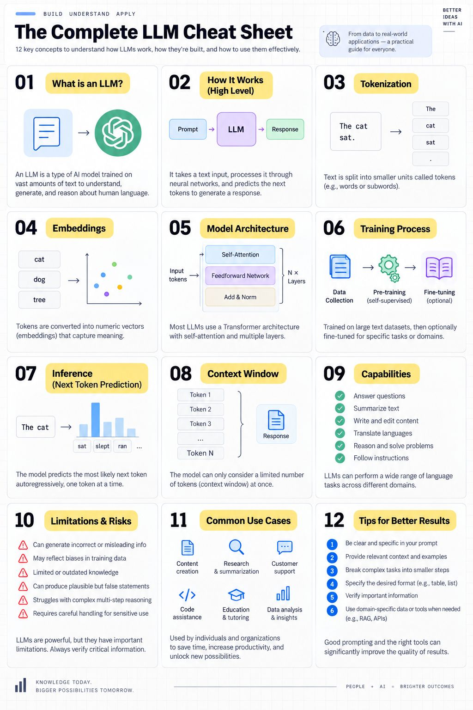

 Complete LLM Cheat Sheet covering 12 concepts:
01 — What is an LLM?
02 — How an LLM works
03 — Tokenization
04 — Embeddings
05 — Transformer architecture
06 — Training process
07 — Inference & next-token prediction
08 — Context window
09 — Capabilities
10 — Limitations & risks
11 — Common use cases
12 — Tips for better results
One concept that helped me understand LLMs:

An LLM isn't simply a database that searches for an answer.

At inference time, it processes the context you provide and generates a response token by token based on patterns learned during training.

And that explains a lot.
Why context matters.
Why prompting matters.
Why hallucinations can happen.
Why RAG and tools are useful.
Why a larger context window isn't the same thing as long-term memory.

Once these fundamentals are clear, concepts like RAG, function calling, MCP, tool use, memory, and AI agents become much easier to understand.

The goal isn't just to use AI.

It's to understand enough of the system underneath it to build better things with it.