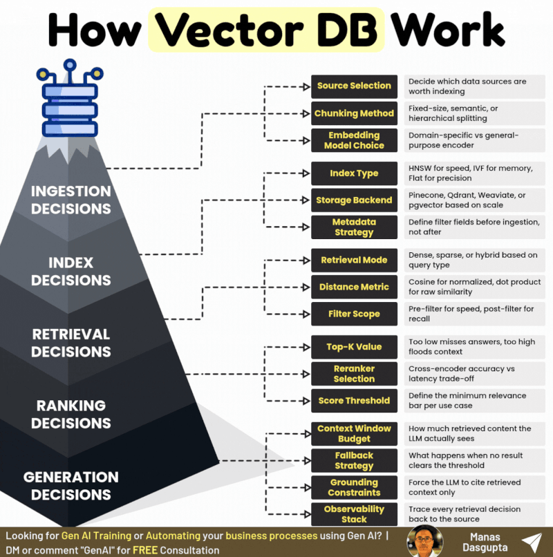

RAG is not a feature.
It is a series of engineering decisions that compound across 5 layers.

Get one layer wrong and the whole system degrades silently.

𝟏. 𝐒𝐨𝐮𝐫𝐜𝐞 𝐒𝐞𝐥𝐞𝐜𝐭𝐢𝐨𝐧: Index the wrong sources and no retrieval strategy saves you.

𝟐. 𝐂𝐡𝐮𝐧𝐤𝐢𝐧𝐠 𝐌𝐞𝐭𝐡𝐨𝐝: Fixed, semantic, or hierarchical. Each has a different failure mode.

𝟑. 𝐄𝐦𝐛𝐞𝐝𝐝𝐢𝐧𝐠 𝐌𝐨𝐝𝐞𝐥: General-purpose encoders underperform on specialized domain queries.

𝟒. 𝐈𝐧𝐝𝐞𝐱 𝐓𝐲𝐩𝐞: HNSW for speed. IVF for memory efficiency. Flat for maximum precision.

𝟓. 𝐒𝐭𝐨𝐫𝐚𝐠𝐞 𝐁𝐚𝐜𝐤𝐞𝐧𝐝: Pinecone, Qdrant, Weaviate, or pgvector. Scale determines the answer.

𝟔. 𝐌𝐞𝐭𝐚𝐝𝐚𝐭𝐚 𝐒𝐭𝐫𝐚𝐭𝐞𝐠𝐲: Define filter fields before ingestion. Retrofitting metadata is painful.

𝟕. 𝐑𝐞𝐭𝐫𝐢𝐞𝐯𝐚𝐥 𝐌𝐨𝐝𝐞: Dense alone misses keyword matches. Hybrid covers both signal types.

𝟖. 𝐃𝐢𝐬𝐭𝐚𝐧𝐜𝐞 𝐌𝐞𝐭𝐫𝐢𝐜: Cosine for normalized embeddings. Dot product for raw similarity scores.

𝟗. 𝐅𝐢𝐥𝐭𝐞𝐫 𝐒𝐜𝐨𝐩𝐞: Pre-filter improves speed. Post-filter improves recall. Know the trade-off.

𝟏𝟎. 𝐓𝐨𝐩-𝐊 𝐕𝐚𝐥𝐮𝐞: Too low and you miss valid answers. Too high and you flood the context window.

𝟏𝟏. 𝐑𝐞𝐫𝐚𝐧𝐤𝐞𝐫 𝐒𝐞𝐥𝐞𝐜𝐭𝐢𝐨𝐧: Cross-encoders improve accuracy but add latency. Choose deliberately.

𝟏𝟐. 𝐒𝐜𝐨𝐫𝐞 𝐓𝐡𝐫𝐞𝐬𝐡𝐨𝐥𝐝: No minimum bar means low-confidence results reach the LLM every time.

𝟏𝟑. 𝐂𝐨𝐧𝐭𝐞𝐱𝐭 𝐁𝐮𝐝𝐠𝐞𝐭: Retrieved content must fit the token window without truncating key chunks.

𝟏𝟒. 𝐅𝐚𝐥𝐥𝐛𝐚𝐜𝐤 𝐒𝐭𝐫𝐚𝐭𝐞𝐠𝐲: Define what happens at zero results before it happens in production.

𝟏𝟓. 𝐆𝐫𝐨𝐮𝐧𝐝𝐢𝐧𝐠 𝐂𝐨𝐧𝐬𝐭𝐫𝐚𝐢𝐧𝐭𝐬: Force the LLM to answer from retrieved context only, not from weights.

𝟏𝟔. 𝐎𝐛𝐬𝐞𝐫𝐯𝐚𝐛𝐢𝐥𝐢𝐭𝐲 𝐒𝐭𝐚𝐜𝐤: Trace every retrieval decision or you cannot debug what went wrong.

RAG is not plug and play. It is an engineering discipline with 16 decisions that compound.

