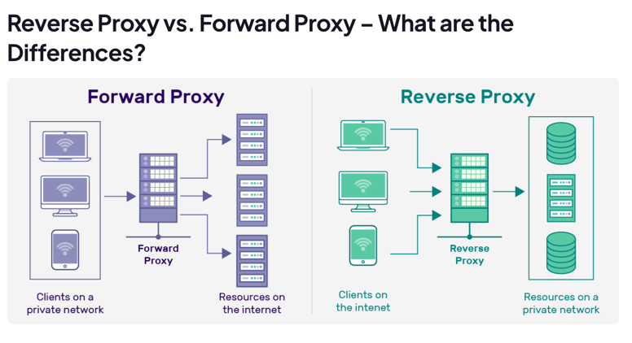

# What is a Reverse Proxy?





A **reverse proxy** is a server that sits between client devices and one or more backend web servers. It receives client requests and forwards them to the appropriate backend server.

Unlike a **forward proxy**, which hides the identity of the client, a **reverse proxy hides the identity of the backend servers**. It acts as an intermediary that provides:

- Load balancing
- Security
- Caching
- SSL/TLS termination
- Traffic routing
- Performance optimization
- High availability

---

# How Does a Reverse Proxy Work?

A reverse proxy sits in front of the origin server and acts as an intermediary between clients and backend servers.

## Request Flow

1. A client sends a request by entering a URL or clicking a link.
2. The reverse proxy receives the request.
3. It determines which backend server should process the request.
4. The request is forwarded to the selected backend server.
5. The backend server processes the request and generates a response.
6. The reverse proxy receives the response.
7. The reverse proxy forwards the response back to the client.

```text
Client
   │
   ▼
Reverse Proxy
   │
   ├────────► Server A
   ├────────► Server B
   └────────► Server C
```

---

## Additional Responsibilities

Besides forwarding requests, a reverse proxy can also perform:

- Load balancing
- SSL termination
- Caching
- Compression
- Authentication
- URL rewriting
- Traffic routing
- Monitoring and logging

Traffic can also be routed based on:

- Geographic location
- User-Agent
- Cookies
- URL path
- HTTP headers

---

# Reverse Proxy vs Forward Proxy

## What is a Proxy?

A **proxy** is an intermediary server positioned between a client and another server.

Its purpose is to:

- Receive requests
- Forward requests
- Receive responses
- Return responses

---

# What is a Forward Proxy?

A **forward proxy** operates on behalf of clients.

It is the designated exit point from a private network to the Internet.

```text
Client
   │
   ▼
Forward Proxy
   │
   ▼
Internet
```

The destination server only sees the proxy's IP address.

---

# What is a Reverse Proxy?

A **reverse proxy** operates on behalf of backend servers.

It is the entry point into a private network.

```text
Internet
    │
    ▼
Reverse Proxy
    │
 ┌──┴──────┐
 ▼         ▼
Server1  Server2
```

Clients never directly communicate with backend servers.

---

# Similarities Between Forward and Reverse Proxy

Both act as intermediaries and provide benefits such as:

- Improved security
- Better performance
- Traffic management
- Caching
- Monitoring
- Hiding internal network structure

---

# Differences Between Forward and Reverse Proxy

| Feature | Forward Proxy | Reverse Proxy |
|----------|---------------|---------------|
| Position | Between Client and Internet | Between Client and Server |
| Protects | Client | Server |
| Traffic Direction | Outbound | Inbound |
| Hides | Client IP | Server IP |
| Used By | Individuals, Employees | Organizations |
| Authentication | User Authentication | Server Authentication |
| Main Goal | Privacy, Content Filtering | Performance, Security, Scalability |

---

# Use Cases

## Forward Proxy Use Cases

### 1. Content Filtering

Blocks unwanted websites.

Example:

- Blocking social media in offices.
- Restricting adult websites.

---

### 2. Access Control

Controls which websites users may access.

Example:

- Schools blocking gaming websites.
- Companies allowing only approved websites.

---

### 3. Bandwidth Optimization

Caches commonly visited websites.

Benefits:

- Reduced internet usage
- Faster browsing

Example:

Frequently visited websites are served directly from cache.

---

# Reverse Proxy Use Cases

## 1. Compression

Compresses responses before sending them.

Benefits:

- Less bandwidth
- Faster page loading

---

## 2. Application Acceleration

Optimizes applications by:

- Compressing images
- Minifying CSS
- Minifying JavaScript

---

## 3. Authentication & Single Sign-On (SSO)

Performs authentication before requests reach backend servers.

Benefits:

- Single login
- Centralized authentication
- Improved security

---

# Comparison Chart

| Criteria | Forward Proxy | Reverse Proxy |
|-----------|---------------|---------------|
| Traffic | Client → Internet | Internet → Server |
| Authentication | User | Server |
| Caching | Client Requests | Static Content |
| SSL/TLS | Creates SSL for Client | Terminates SSL for Server |
| Firewall | Minimal | Often includes WAF |
| Scalability | Number of Clients | Number of Servers |
| Protocols | HTTP, HTTPS, FTP | HTTP, HTTPS, TCP, SSL |

---

# Benefits of Reverse Proxy

## 1. Load Balancing

Distributes requests across multiple servers.

Benefits:

- Prevents overload
- Improves availability
- Better response time

Example:

```text
           Reverse Proxy
          /      |      \
         /       |       \
 Server A   Server B   Server C
```

---

## 2. Caching

Stores frequently requested content.

Benefits:

- Faster responses
- Lower backend load

Example:

Product images on an e-commerce website.

---

## 3. SSL Termination

Handles SSL encryption/decryption.

Benefits:

- Backend servers perform less work.
- Simplified certificate management.
- Improved performance.

```text
HTTPS
Client
   │
   ▼
Reverse Proxy
 (Decrypt SSL)
   │
HTTP
   ▼
Backend Server
```

---

## 4. Threat Prevention

Protects backend servers by:

- Blocking malicious requests
- Rate limiting
- IP filtering
- Hiding server IP addresses

Benefits:

- Prevents DDoS attacks
- Blocks suspicious traffic
- Reduces attack surface

---

## 5. Scalability

Servers can be added or removed without downtime.

Benefits:

- Horizontal scaling
- Better availability

---

## 6. Compression

Compresses:

- HTML
- CSS
- JavaScript
- JSON

Benefits:

- Lower bandwidth
- Faster downloads

---

## 7. Intelligent Routing

Routes requests based on:

- URL path
- HTTP headers
- Geographic region
- Cookies

Example:

```text
/api/*
   │
   ▼
API Server

/static/*
   │
   ▼
Static Server
```

---

## 8. Monitoring and Logging

Collects:

- Request logs
- Error logs
- Traffic metrics
- Performance metrics

Benefits:

- Easier troubleshooting
- Security monitoring

---

## 9. Flexibility

Can modify requests and responses.

Examples:

- URL rewriting
- Header manipulation
- Cookie modification
- Redirects

---

# Is WAF a Reverse Proxy?

Yes.

A **Web Application Firewall (WAF)** is typically implemented as a specialized reverse proxy.

It intercepts client traffic before it reaches the backend servers.

```text
Client
   │
   ▼
WAF
   │
   ▼
Reverse Proxy
   │
   ▼
Application Servers
```

---

## What Does a WAF Protect Against?

A WAF filters malicious requests and protects against attacks such as:

- SQL Injection (SQLi)
- Cross-Site Scripting (XSS)
- Session Hijacking
- Command Injection
- Remote File Inclusion
- Local File Inclusion
- CSRF
- OWASP Top 10 vulnerabilities
- Zero-day attacks

---

## Additional WAF Features

Modern WAFs can also provide:

- Load balancing
- API protection
- Rate limiting
- Bot protection
- DDoS mitigation
- Threat intelligence
- Traffic filtering
- Zero false positives (vendor dependent)

---

# Summary

## Forward Proxy

- Represents the client
- Hides client identity
- Used for privacy and content filtering
- Controls outbound traffic

## Reverse Proxy

- Represents backend servers
- Hides server identity
- Improves performance
- Enables load balancing
- Handles SSL termination
- Provides caching
- Enhances security
- Supports scalability
- Performs intelligent routing
- Often includes WAF functionality

A reverse proxy is one of the most important components in modern cloud-native architectures because it provides a single entry point for clients while improving security, availability, and performance.

